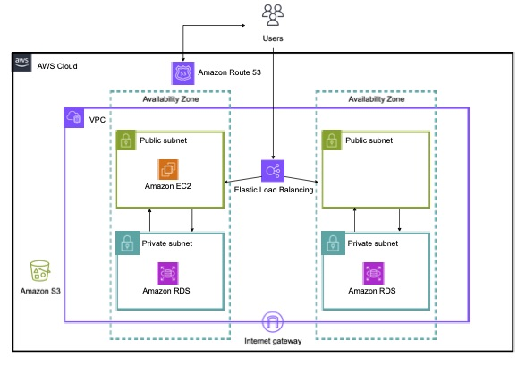

# Daily-Check
『Daily-Check』は塗装や足場の架設などの作業をしている会社の社員を対象に作成しました。
現場の作業内容や連絡事項をどこでも手軽に確認できるサービスです。

URL： https://daily-check.click

ログインする際は以下をお使いください。
名前：ゲストユーザー
パスワード：guestPassword

## ホーム画面

## クラウドアーキテクチャー

## ER図

## 特徴的な機能の提案

- **写真を圧縮して保存する機能**
  アップロードされた写真を自動的に圧縮し、ストレージ容量を節約 これにより、ユーザーのデータ通信量も削減される

- **動的なインターフェース（Livewire）**
  Livewireを用いて、ユーザーの操作に応じてリアルタイムで内容が変化する動的なインターフェースを構築 これにより、操作の手間が省け、迅速な情報提供が可能

- **検索・フィルタリング機能**
  日付、担当者、作業内容、現場など、様々な条件で情報を素早く検索・フィルタリングできる機能 ユーザーが必要な情報を効率よく見つけられるようにすることで作業の迅速化を図る

- **データ選択機能**
  データベースに登録されている情報を選択形式で簡単に選べる機能 これにより、新しい作業記録の作成時に手動入力の手間を省き、効率的に入力作業を行うことが可能になる

## 使用した技術

### フロントエンド
- **HTML/CSS**: アプリケーションの基本的な構造とスタイルを提供
- **JavaScript**: インタラクティブな要素や動的なコンテンツの制御
- **Livewire**: リアルタイムで反応する動的インターフェースを実現するためのLaravelのフレームワーク
- **Laravel Volt**: Livewireと組み合わせたSPA（シングルページアプリケーション）対応
- **ESLint/Prettier**: JavaScriptコードの品質を保つためのコード解析と整形ツール

### バックエンド
- **PHP 8.1**: アプリケーションロジックの実装に使用
- **Laravel 10.10**: バックエンド全体のフレームワークとして利用
- **Laravel Sanctum**: シンプルで安全なAPIトークン認証を提供
- **Intervention Image**: 画像操作（リサイズや圧縮など）を行うためのライブラリ
- **PHPUnit**: 単体テストフレームワーク 開発中のテスト駆動開発（TDD）を支援
- **Laravel Breeze**: 軽量の認証パッケージで、迅速に認証機能を実装

### インフラ・開発環境
- **AWS S3**: 画像や書類などのファイルのストレージとして使用
- **AWS EC2**: アプリケーションのホスティング
- **AWS RDS**: データベースサーバーとしてMySQLをホスティング
- **AWS IAM**: ユーザーと権限の管理
- **AWS CloudFormation**: インフラストラクチャをコードとして管理
- **AWS Route 53**: ドメインネームサービス
- **AWS Certificate Manager**: SSL/TLS証明書の管理
- **AWS VPC**: 仮想プライベートクラウド内でのネットワーク設定
- **Spatie Laravel Ignition**: エラーハンドリングの強化

### 開発ツール
- **Git**: バージョン管理システム
- **GitHub/GitLab**: リポジトリホスティングとコードレビュー

## 機能一覧

### ログイン画面
- 当日の必要情報掲示

### ホーム
- ログイン
- 週間予定表示
- 現場ごと従業員スケジュール表示

### 写真
- 写真を投稿・編集・表示

### 書類
- 書類を投稿・編集・表示

### 日報
- 日報を投稿・編集・表示

### 管理者ページ
- 現場・従業員・スケジュール・写真・書類・従業員を投稿・編集・削除
